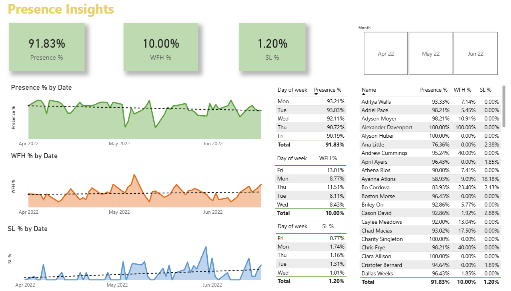

## **HR Analytics Dashboard**
**Project Objective**
This project analyzes employee attrition and performance to support data-driven HR management. The dashboard identifies workforce trends and potential risks to assist in executive decision-making.

**Business Requirements**
- Define and monitor key HR KPIs including Attrition Rate and Performance levels.

- Analyze demographic factors such as Age and Gender diversity across departments.

- Identify correlations between employee tenure and turnover risks.

**Technical Implementation**

- Data Processing: Imported and transformed raw Excel data using Power Query.

- Data Modeling: Established relational schemas and created measures using DAX.

- Visualization: Designed an interactive Power BI dashboard with slicers for multi-dimensional analysis.

**Key Deliverables**
- Fully interactive Power BI report (.pbix).

- Masked dataset ensuring data privacy for analysis.